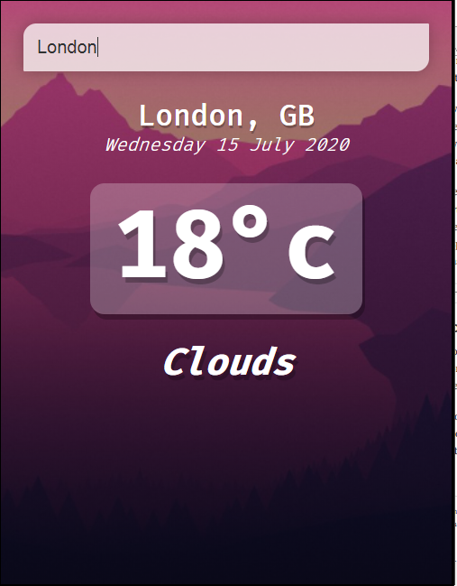
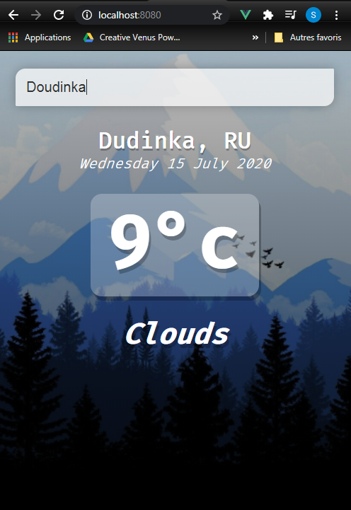

# Weather vue-app

> A Vue.js project
***
 Simple weather application web (SPA) using the javascript's framework : Vue.js.
 > All you need is to type the name of the city you want to know its weather in search part, then press Enter..

## Images of the App

***

## Build Setup

``` bash
# install dependencies
npm install

# Create the project
vue init webpack nameOfProject 

# serve with hot reload at localhost:8080
npm run dev

# build for production with minification
npm run build

# build for production and view the bundle analyzer report
npm run build --report
```

For a detailed explanation on how things work, check out the [guide](http://vuejs-templates.github.io/webpack/) and [docs for vue-loader](http://vuejs.github.io/vue-loader).

Vue.js [documentation](https://vuejs.org/v2/guide/)

***
I hope you'll enjoy this app. Thank you.
